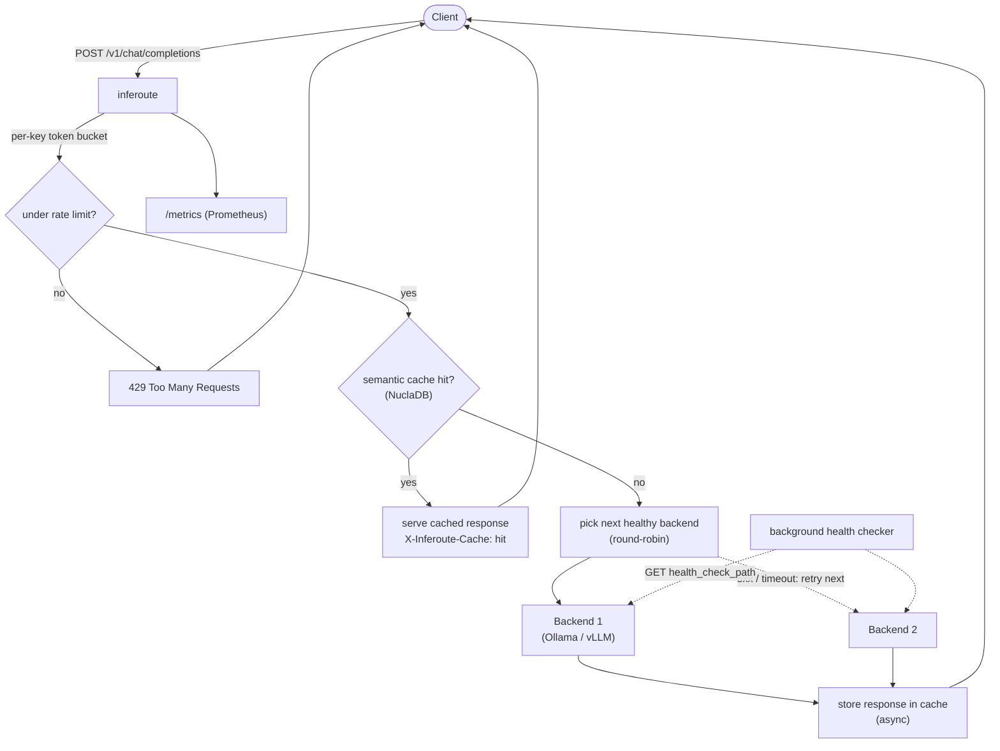

# inferoute

[](https://github.com/Rakshit-gen/inferoute/actions/workflows/ci.yml)
[](LICENSE)

An OpenAI-compatible inference gateway written in Go: it round-robins
requests across multiple LLM backends serving the same model (e.g. several
Ollama or vLLM instances), health-checks them, fails over to the next
healthy one on error, streams SSE responses straight through unbuffered,
rate-limits per API key (in-process or shared across instances via Redis),
and semantically caches responses — streaming included — using
[NuclaDB](https://github.com/Rakshit-gen/NuclaDB).

## Why

The inference *engines* (vLLM, SGLang, llama.cpp, Ollama) are a solved,
crowded problem. The layer that routes to them — load balancing, failover,
caching, observability — is not, and it's infrastructure glue, which is
what Go is for.

## Architecture



Every arrow above is real request-handling code, not aspirational — see
`internal/proxy/proxy.go` for the exact order of operations.

## Quickstart

Run two Ollama instances serving the same model, so there's actually
something to route between:

```sh
OLLAMA_HOST=127.0.0.1:11434 ollama serve &
OLLAMA_HOST=127.0.0.1:11435 ollama serve &
ollama pull llama3
```

Install and run inferoute against them — one command if you have Go:

```sh
curl -fsSL https://raw.githubusercontent.com/Rakshit-gen/inferoute/main/install.sh | sh
curl -O https://raw.githubusercontent.com/Rakshit-gen/inferoute/main/config.example.json
inferouted -config config.example.json
```

Or build from source:

```sh
go build -o bin/inferouted ./cmd/inferouted
./bin/inferouted -config config.example.json
```

`config.example.json` already points at `:11434` and `:11435` for `llama3`.
Send it a request:

```sh
curl localhost:8081/v1/chat/completions \
  -d '{"model":"llama3","messages":[{"role":"user","content":"hi"}]}'
```

You'll get back whatever Ollama returns, unmodified — inferoute just picked
which of the two instances handled it:

```json
{"model":"llama3","message":{"role":"assistant","content":"..."}, ...}
```

Run it a few more times and kill one `ollama serve` process: the next
request fails over to the survivor instead of erroring. `/metrics` serves
Prometheus metrics, `/healthz` is a liveness probe, `/v1/models` lists the
served models (OpenAI shape, for SDKs), `/v1/backends` reports each
backend's name, models, and current health, `/v1/config` reports the model
aliases and which features are enabled, and `/docs` serves a full
documentation page straight from the running binary:

```sh
curl localhost:8081/v1/backends
# [{"name":"ollama-1","url":"http://localhost:11434","models":["llama3"],"healthy":true}, ...]
```

### No GPUs handy?

`scripts/local-stack.sh` builds and runs the gateway in front of two mock
inference backends (`scripts/mock-openai-backend`, which echoes prompts back
and can stream), so you can exercise routing, failover, streaming, and the
dashboard with nothing but Go installed:

```sh
./scripts/local-stack.sh          # gateway on :8091, Ctrl-C stops it
```

Or skip the local Go/Ollama install and run everything in containers:

```sh
docker compose up --build
```

That starts inferoute plus two Ollama containers (`docker-compose.yml`,
config in `config.docker.json`); `docker exec` into either Ollama container
to `ollama pull llama3` before sending traffic. Semantic caching and
Redis-backed rate limiting aren't included in the compose file — they need
NuclaDB and/or Redis running alongside it, see below.

### Deploy to Render

inferoute is a stateless HTTP proxy, so it deploys as a plain Render web
service built from `Dockerfile` — it doesn't need a database or persistent
disk itself:

1. **New > Web Service** on the [Render dashboard](https://dashboard.render.com),
   connect this repo, and pick **Docker** as the runtime. Render detects
   `Dockerfile` at the repo root automatically.
2. Set the health check path to `/healthz`.
3. Add your real `config.json` as a **Secret File** named `config.json`
   (Environment tab). Render mounts it at `/etc/secrets/config.json`, which
   is exactly what `Dockerfile`'s `CMD` points `-config` at by default — no
   start-command override needed.
4. Your backends (the Ollama/vLLM instances in that config) need to be
   reachable from Render's network — a `localhost` URL only works if
   inferoute and the backend are both running on your machine. Point it at
   a publicly reachable inference server, or run backend and gateway in the
   same private network.

Free-tier services spin down after 15 minutes of inactivity and take
30-60s to wake on the next request; the Starter plan keeps it always-on.

## CLI

The binary is `inferouted`, and it has exactly one flag:

```sh
./bin/inferouted -config path/to/config.json   # defaults to ./config.json
./bin/inferouted -h                            # prints usage and exits
```

There's no subcommand or interactive mode — it's a daemon: point it at a
config file, it starts listening, `Ctrl-C` (or `SIGTERM`) shuts it down
cleanly. A `SIGHUP` reloads the `backends` and `model_aliases` sections from
the same config file without restarting (`rate_limit`/`cache` settings are
not reloaded — those need a restart):

```sh
kill -HUP $(pgrep inferouted)
```

Everything else is controlled through the config file below or by calling
the HTTP API it serves.

## Configuration

Everything lives in one JSON file (see `config.example.json` for a working
one). Plain-English rundown of each section:

| Field | What it does |
|---|---|
| `listen_addr` | The address inferoute itself listens on, e.g. `:8081`. |
| `health_check_path`, `health_check_interval` | Which path to `GET` on each backend to check it's alive, and how often. |
| `backends` | The list of servers to route to. Each entry is `{name, url, models, path_prefix, api_key, weight}` — `models` is the list of model names that backend can serve (two backends listing the same model get load-balanced between); `path_prefix` is prepended to the client's request path for backends that mount their API under a path (e.g. Groq's OpenAI-compatible endpoint lives under `/openai`, so `path_prefix: "/openai"` turns a client's `/v1/chat/completions` into `/openai/v1/chat/completions`); `api_key`, if set, is sent as that backend's `Authorization: Bearer` header, overriding whatever the client sent — for gatewaying a hosted provider behind a key callers shouldn't need to know; `weight` biases the `weighted` load-balancing strategy toward beefier backends (default 1, ignored by the other strategies). All optional. |
| `load_balancing` | How to pick a backend among the healthy ones for a model: `round_robin` (default, even rotation), `least_pending` (fewest in-flight requests: best when request durations vary a lot), or `weighted` (random, biased by each backend's `weight`). |
| `rate_limit.enabled` | Turn per-API-key rate limiting on or off. Off by default. |
| `rate_limit.requests_per_second`, `.burst` | Steady-state rate and how many requests can burst above it before a caller starts getting `429`s. |
| `rate_limit.redis_addr` | Leave empty for a per-instance limiter (fine for one gateway). Set to a `host:port` to share limit state across a fleet of inferoute instances via Redis instead. |
| `cache.enabled` | Turn semantic response caching on or off. Off by default, and requires a running [NuclaDB](https://github.com/Rakshit-gen/NuclaDB) instance. |
| `cache.nucladb_addr` | Where that NuclaDB instance is. |
| `cache.embedding_backend_addr`, `.embedding_model` | Which Ollama-compatible server and model to use to turn a prompt into a vector for cache lookups. |
| `cache.max_distance` | How close a cached prompt has to be to count as a hit — see the note below, the naming here is easy to get backwards. |
| `cache.tenant_id` | The NuclaDB tenant inferoute's cache vectors are stored under. |
| `model_aliases` | Maps a requested model name to the one your backends actually serve, e.g. `{"gpt-4": "llama3"}` routes `gpt-4` requests to whatever backend lists `llama3`. Empty by default (no aliasing). |
| `cors_origins` | Browser origins allowed to call the HTTP API (the `web/` dashboard, and the playground's `POST /v1/chat/completions`). A single `["*"]` allows any origin; otherwise list each exactly. Defaults to `["*"]`. Non-browser clients send no `Origin` and are unaffected. |
| `api_keys` | Allowlist of bearer tokens accepted on `POST /v1/chat/completions`. When non-empty, any request without a listed `Authorization: Bearer <key>` gets `401`. Empty (the default) leaves the proxy open. Reloaded on `SIGHUP`. Introspection (`/v1/backends`, `/v1/config`, `/metrics`) is not gated — firewall it or put a reverse proxy in front if it needs protecting. |

Every field has a sane default except `backends`, which is required.

## Features

- **Routing + failover**: reads `model` from the request body (resolved
  through `model_aliases` first, if configured), picks a healthy backend
  registered for it, and retries the next one on a connection error or 5xx
  (up to 3 attempts, marking the failed backend unhealthy).
- **Load balancing** (`load_balancing` in config): how the healthy backends
  for a model share traffic.
  - `round_robin` (default): even rotation. Best when every backend is the
    same size and requests cost about the same.
  - `least_pending`: send each request to the backend with the fewest
    in-flight requests right now. Best when request durations vary a lot
    (a long generation on one backend won't keep drawing new requests to
    it) or when backends have uneven capacity.
  - `weighted`: random, biased by each backend's `weight` (default 1). Put
    a bigger `weight` on the bigger box, e.g. `weight: 4` on an 8×A100 node
    next to `weight: 1` on a single-GPU one.
- **Streaming**: SSE responses are flushed to the client chunk-by-chunk as
  the backend produces them, not buffered.
- **Model aliasing** (`model_aliases` in config): let callers request a
  model name your backends don't actually use (e.g. `gpt-4`) and route it to
  one they do.
- **Rate limiting** (`rate_limit` in config): per-API-key token bucket
  (`Authorization: Bearer <key>`, falling back to remote IP). 429 over the
  limit. In-process by default; set `rate_limit.redis_addr` to share the
  limit across multiple inferoute instances behind a load balancer instead.
- **API-key auth** (`api_keys` in config): an allowlist of bearer tokens.
  Non-empty means `POST /v1/chat/completions` requires a listed key (401
  otherwise); empty leaves the proxy open. Reloaded on `SIGHUP`.
- **Semantic caching** (`cache` in config): chat requests — streaming
  included — are embedded (via an Ollama-compatible `/api/embeddings`
  endpoint), looked up in NuclaDB, and served from cache on a close match; a
  cached streaming response is replayed as the exact bytes originally
  captured. Misses are stored after the backend responds.
- **Config hot-reload**: `SIGHUP` reloads `backends` and `model_aliases`
  from the config file without dropping in-flight requests or restarting
  the process.
- **Introspection**: `/v1/models` (OpenAI-compatible model list),
  `/v1/backends` (every backend's name, URL, models, health), and
  `/v1/config` (aliases and which features are on).
- **Metrics** (`/metrics`): request count by model/backend/status, request
  latency histogram by model, cache hit/miss/error counts. Point Prometheus
  or Grafana at it.

## Benchmarks

Measured against the real `inferouted` binary — not estimated. Everything
below ran on one dev machine (the load generator, fake backend, and gateway
all sharing the same CPU cores), so treat the absolute numbers as
directional rather than an isolated production benchmark; the relative
shape (small fixed overhead, huge cache win) is the real finding.

**Routing overhead** — `ab -n 2000 -c 20`, direct to a near-zero-latency
backend vs. through inferoute (round-robin over 1 backend, no cache, no
rate limit):

| | Requests/sec | Mean latency | p50 | p99 |
|---|---|---|---|---|
| Direct to backend | ~11,400 | 1.8ms | 0ms | 1ms |
| Through inferoute | ~3,450 | 5.8ms | 1ms | 31ms |

A few milliseconds of routing/retry/body-parsing overhead under concurrent
load — real, but small next to actual inference latency (hundreds of ms to
seconds).

**Semantic cache** — a backend with an artificial 700ms delay (standing in
for real LLM inference time) behind a NuclaDB-backed cache, 20 trials each:

| | Mean latency |
|---|---|
| Cache miss (unique prompt, hits the backend) | 705.7ms |
| Cache hit (repeated prompt, served from NuclaDB) | 0.80ms |

**~880x faster on a hit** — confirmed via the `X-Inferoute-Cache: hit`
response header on all 20 hit requests, not inferred from timing alone.

## Semantic cache setup notes

Two things that will silently misbehave if you get them wrong, found by
actually running this against a real NuclaDB instance rather than trusting
the proto docs:

- **`nucladbd -dim` must match your embedding model's output size.**
  NuclaDB is started with a fixed vector dimension for the whole database;
  point `cache.embedding_model` at a model that produces vectors of that
  exact length, or inserts will be rejected.
- **`cache.max_distance`, not a similarity threshold.** NuclaDB's cosine
  "score" is `1 - cosine_similarity` — a *distance*, where `0` means
  identical and larger means further apart. `max_distance` is compared
  directly against that: a smaller number means a stricter match. This is
  the opposite of what "similarity threshold" naming would suggest, which
  is exactly the bug the first version of this cache had — verified and
  fixed by round-tripping identical and different prompts against a live
  NuclaDB instance and checking the actual scores returned, not by
  reasoning about it from the proto file.

## Status

Working end-to-end, verified against real binaries (not just unit tests):
routing, round-robin, health-checked failover, streaming passthrough,
model aliasing, `SIGHUP` config reload, `/v1/backends` introspection,
per-key rate limiting (both in-process and Redis-backed), and NuclaDB-backed
semantic caching — including caching a streaming response and replaying it
on a hit — with real cache-hit/cache-miss behavior confirmed against a live
NuclaDB instance and real Redis, not fakes.

Not yet built: batched/async cache writes at scale, cache eviction/TTL (a
long-running gateway's cache tenant grows forever), true latency-aware
routing (`least_pending` approximates it), a circuit breaker for flaky (as
opposed to fully down) backends, and TLS termination (put it behind a
reverse proxy for that today).

See tests in `internal/backend`, `internal/proxy`, `internal/cache`, and
`internal/ratelimit` for the behavior that's actually verified.
